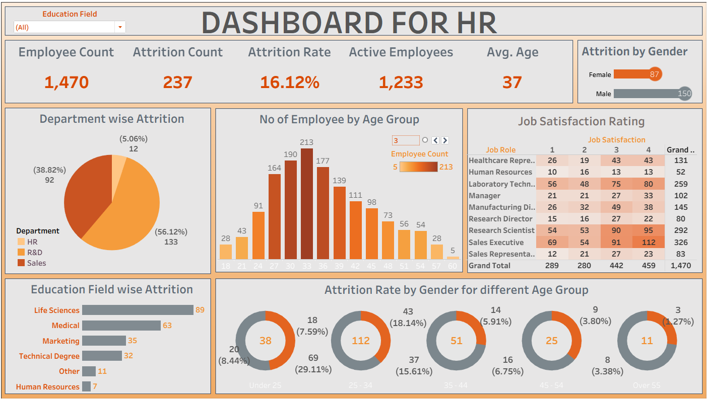

# DASHBOARD-FOR-HR

## 🎯 Project Objective

The goal of this project is to:

- Create a dynamic and interactive HR dashboard using Tableau.
- Analyze key HR metrics such as attrition rate, gender ratio, departmental distribution, and more.
- Provide a visual overview of employee trends and organizational health.
- Enhance data storytelling in HR using Tableau’s visualization features.

## 📌 Key Features

The dashboard contains the following sections:

### 1. **KPI Indicators**
- **Total Employees**
- **Attrition Rate**
- **Active vs Exited Employees**
- **Gender Diversity (Male/Female Breakdown)**

### 2. **Department-Wise Distribution**
- Bar chart showing employee count per department
- Comparison of active and exited employees per department

### 3. **Job Role Breakdown**
- Total employees by job role
- Insights into which roles face higher attrition

### 4. **Age Band Analysis**
- Pie chart of employee distribution across age bands
- Used to assess the generational structure of the workforce

### 5. **Attrition Trend**
- Line chart displaying monthly attrition rates
- Seasonal or departmental trends can be spotted

### 6. **Additional Filters**
- Interactive filters for:
  - Gender
  - Department
  - Job Role
  - Age Band
  - Attrition Status
  - Education

The dashboard calculates and visualizes:

- **Attrition Rate**: `(Exited Employees / Total Employees) * 100`
- **Active vs Exited**: Current status of employees
- **Departmental Share**: % of total employees per department
- **Gender Ratio**: Male vs Female employee counts
- **Age Group Distribution**: Age-wise breakdown of workforce

## 🧠 Insights You Can Derive
- Departments with the highest attrition rates
- Gender imbalance or diversity challenges
- Age demographics of your organization
- Impact of education/job role on employee exits
- Monthly or quarterly attrition patterns
